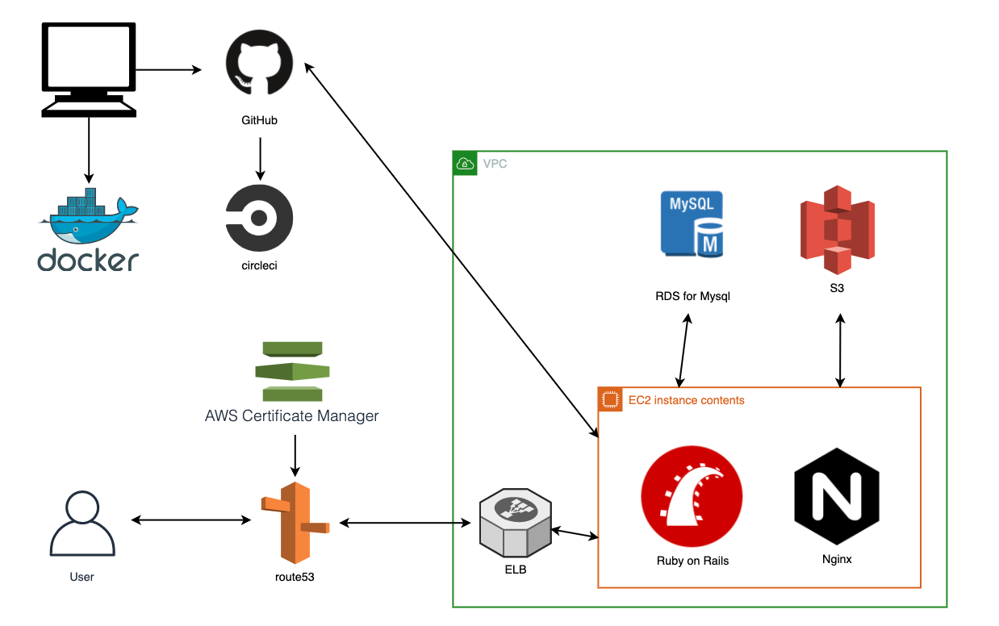

# Sharemusic
https://www.sharemusictokyo.com

音楽アルバムのレビューを様々な人とシェア出来るサービスです。

数年前まで私は、お金を貯めてCDを買い、次に何が流れるか把握するまでアルバムを聴き込んでいました。 
しかしサブスクリプションの普及により、1曲や1アーティストにかける時間が減り 
広く浅く音楽を聴くように変化しました。

私だけでなく多くの人が広く浅く音楽を聴くように変化したのではないでしょうか。

いつでも聴きたい音楽が聴ける現代だからこそ 
曲はもちろん、アルバムの曲順や、ジャケットのデザインなど 
アーティストのこだわりを深く理解しようとする姿勢を持つことで 
音楽を聴く行為がさらに楽しいものになって欲しいという思いがあります。

### インフラ構成図

### このアプリを開発した理由
アルバムについて考えたことや感じたことを文字起こしし、それをシェアすることにより 
1曲1曲やアルバム1枚を深く理解しようとする姿勢の向上に繋がるのでは？という考えから開発しました。

### 開発において工夫したこと
* 操作方法がわかりやすいUIデザインを意識しました。
* Spotify APIを使用し簡単にレビューページを作成出来るようにしました。

# 使用技術
フロントエンド(javascript, jQuery, HTML/CSS, Sass) 
バックエンド(Ruby on Rails5.2, Spotify API) 
テスト(RSpec, FactoryBot, Capybara) 
データベース(MySQL) 
コンテナ(Docker, docker-compose) 
開発環境(MacOS, VScode, Git, GitHub, bash) 
本番環境 AWS(VPC, EC2, S3, RDS, Route53, IAM, ELB, ACM)
CircleCi

# 機能
### アルバム検索
* 新規アルバム検索 
* 既存アルバム検索

### アルバムレビュー
* 五段階評価
* アルバムの平均点 
* タイトルと本文 
* 自分が投稿したレビュー意外にいいねが可能

### ユーザーフォロー
* フォロー一覧 
* フォロワー一覧

### DM
* メッセージ送信機能

### 通知
* メッセージ受信時に通知 
* フォローされた際に通知 
* 自身のレビューがいいねされた際に通知

### UI
* レスポンシブ対応 
* ハンバーガーメニュー

# 今後の課題
* 自動デプロイ導入 
* テストの熟練 
* 非同期通信で動かせる場所を増やし、感覚的に操作が出来るようなUIに改善 
* レビューを書きたくなる機能の追加

